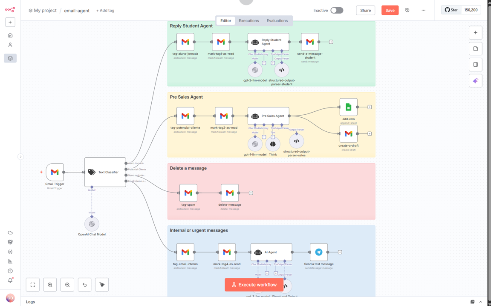

## 📬 Email Agent – Automação Inteligente com n8n + IA
Este projeto é um agente de e-mails multi-skills que interpreta, classifica e responde mensagens automaticamente com base em seu conteúdo. Ele foi desenvolvido com foco em escalabilidade, inteligência contextual e integração com ferramentas modernas.

## 🚀 Funcionalidades
- Classificação automática de e-mails em categorias como:
- Potencial Cliente
- Aluno da Jornada
- Spam ou Irrelevante
- Interno ou Urgente
- Ações automatizadas por categoria:
- Deleta mensagens irrelevantes ou spam
- Gera propostas comerciais estruturadas com IA para leads de pré-vendas
- Responde dúvidas de alunos com tom acolhedor e personalizado
- Envia alertas via Telegram para mensagens urgentes

## 🧠 Tecnologias Utilizadas
- n8n – Orquestração dos fluxos
- OpenAI GPT-4o – Classificação e geração de respostas
- Langchain – Agente de IA com raciocínio estruturado
- Gmail API – Gatilho e envio de mensagens
- Google Sheets – Armazenamento de dados para CRM
- Telegram Bot – Notificações em tempo real

## 📦 Estrutura do Projeto
O fluxo é dividido em agentes especializados:
- Start Classifier: identifica o tipo de e-mail
- Reply Student Agent: responde dúvidas de alunos
- Pre Sales Agent: gera propostas técnicas para leads
- Delete Message: remove e-mails irrelevantes
- Urgent/Internal Agent: envia alertas via Telegram

  

